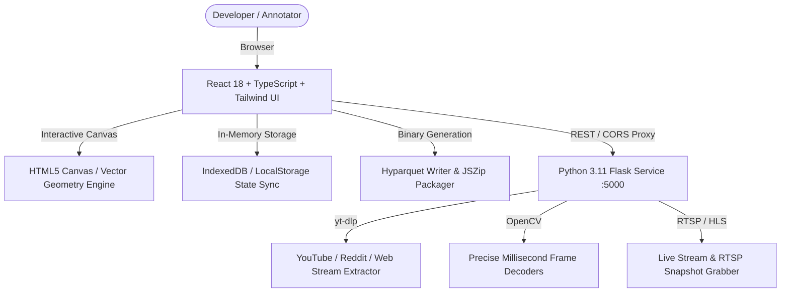

# AnnotateX Studio - Architecture & Engineering Design

AnnotateX Studio is an open-source, full-stack platform designed for rapid dataset creation, multi-modal annotation, and high-fidelity dataset formatting for Deep Learning models.

---

## 🏗️ System Overview

The system is decoupled into two primary subsystems:

---

## 🧩 Core Architectural Components

### 1. Vector Annotation & Geometry Engine (`src/components/Canvas.tsx`, `src/utils/geometry.ts`)
- **Coordinate Space:** Normalized floating-point space `[0..1]` invariant to screen resolution or image scaling.
- **Bounding Boxes (BBoxes):** Supports 8 resize handles (cardinal & ordinal corners) and dynamic translation.
- **Polygons & Segmentation:** Multi-vertex path creator with real-time vertex drag, insertion, deletion, and Graham scan Convex Hull computation.
- **Keypoints & Skeletons:** Multi-point anatomical landmarks with configurable connections.
- **Polylines & Circles:** Smooth linear stroke tracking and radial Euclidean bounding.

### 2. Multi-ClassSet Architecture (`ClassManager.tsx`, `src/types/dataset.ts`)
- Allows defining multiple independent taxonomy layers on the same image dataset.
- Supports switching class sets in real-time or exporting twin datasets with different label schemas from a single project.

### 3. High-Performance Exporter Engine (`formatParsers.ts`, `parquetExporter.ts`, `zipHandler.ts`)
- **YOLO Exporter:** Supports YOLOv11, YOLOv8, YOLOv9, YOLOv10, YOLOv5, YOLOv7, and Darknet with `data.yaml` and train/val split.
- **COCO 1.0 JSON:** Standard Detectron2 and TorchVision annotations.
- **Apache Parquet:** Binary column-oriented `.parquet` dataset embedding compressed image byte buffers, polygon vertices, bounding boxes, and label metadata for instant ingestion via `pandas.read_parquet()` or HuggingFace `datasets`.

### 4. Dedicated NLP & LLM Studio (`NLPWorkspace.tsx`)
- **Extractive QA (SQuAD):** Character span locator with automatic `answer_start` and `answer_end` extraction.
- **Text-to-SQL:** DDL schema + natural language question + ground truth SQL query pairs.
- **Chain-of-Thought (CoT):** Step-by-step reasoning decomposition (`thought`) and final output (`response`).
- **Tool Use & Function Calling:** Structured JSON parameter definitions and deterministic agent tool invocation.
- **RAG Triplet Retrieval:** Search queries with positive relevant passages and hard negative benchmark controls.

### 5. Audio & Speech Processing Studio (`AudioWorkspace.tsx`)
- **Waveform Scrubber:** Visualizer with millisecond precision scrubbing.
- **ASR / STT (Whisper):** Paired audio-text transcription.
- **Speaker Diarization:** Timeline segments with speaker identification (`start`, `end`, `speaker`).
- **Sound Event Detection (SED):** Acoustic environmental event intervals.
- **Forced Alignment:** Word-level temporal synchronization.

### 6. Python Video & Live Stream Server (`server/app.py`)
- Python Flask service leveraging `yt-dlp` and `OpenCV` to eliminate browser sandbox CORS constraints.
- Real-time frame extraction at exact FPS / interval steps and live camera RTSP snapshot capture.
